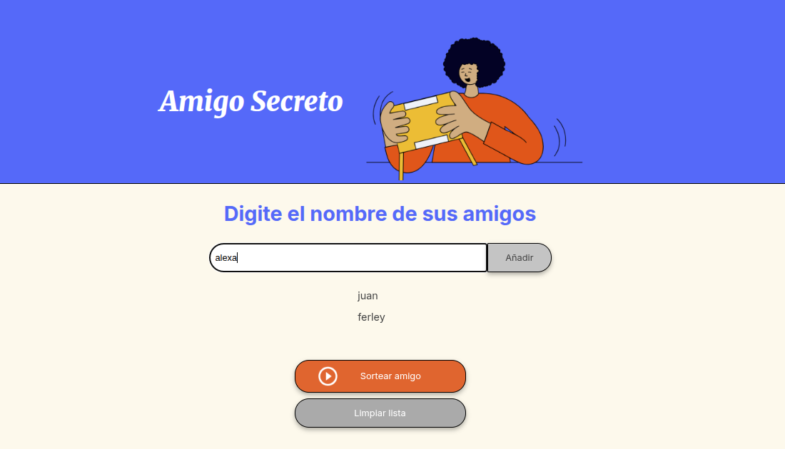
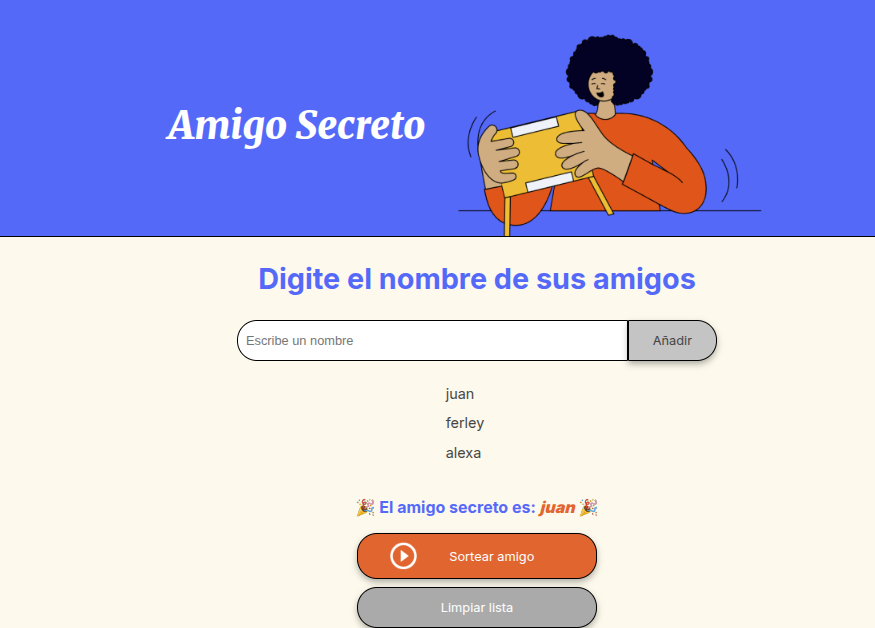
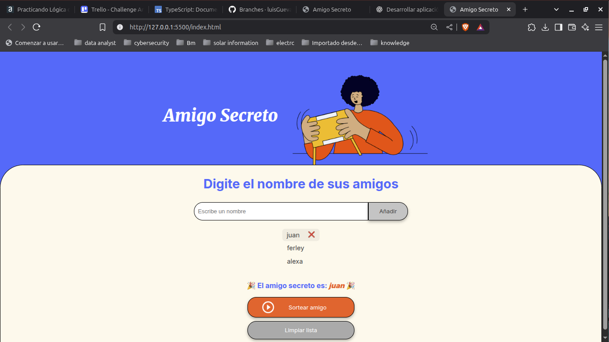

# 🎁 Amigo Secreto

Aplicación web interactiva que permite registrar nombres de personas para realizar un sorteo aleatorio y elegir un "amigo secreto". Ideal para eventos sociales, juegos entre amigos, compañeros de trabajo o celebraciones familiares.

---

## 🧩 Funcionalidades

✅ **Agregar nombres** mediante un campo de texto.  
✅ **Validación de entrada vacía** para evitar errores.  
✅ **Visualización dinámica** de los nombres agregados.  
✅ **Eliminar nombres individualmente** con ícono discreto.  
✅ **Reiniciar la lista completa** con un botón de "Reiniciar".  
✅ **Sorteo aleatorio** de un nombre al hacer clic en "Sortear Amigo".  
✅ **Animaciones suaves** y una interfaz amigable.  
✅ **Diseño responsivo** para móviles y escritorio.  

---

## 🎬 Capturas de pantalla

### ➕ Agregar nombres

### 🎲 Realizar sorteo

### 🗑️ Eliminar nombres

https://www.loom.com/share/0bceb513046c4af7980d2f1c2c9ccc9a?sid=b1174064-f00c-42e8-966c-ae8fe604e35e
---

⚙️ Instalación y uso
Clona el repositorio:

bash
Copiar
Editar
git clone [https://github.com/tu-usuario/amigo-secreto.git](https://github.com/luisGuevaran/amigo-secreto.git)
Entra al directorio:

bash
Copiar
Editar
cd amigo-secreto
Abre el archivo index.html en tu navegador:

📂 Doble clic en index.html, o

🚀 Usa Live Server desde VS Code

🧪 Requisitos
Este proyecto no requiere instalación de librerías externas ni backend. Solo necesitas:

🌐 Un navegador moderno (Chrome, Firefox, Edge, etc.)

🧩 (Opcional) Extensión Live Server para VS Code

## 🐞 Posibles problemas

| Problema                      | Solución                                                                       |
|-------------------------------|--------------------------------------------------------------------------------|
| La lista no se muestra        | Asegúrate de que el archivo `app.js` esté bien enlazado en el HTML            |
| El sorteo no selecciona nadie | Verifica que haya al menos un nombre en la lista antes de sortear             |
| Los estilos no se aplican     | Confirma que `style.css` esté enlazado correctamente en la etiqueta `<head>`  |

